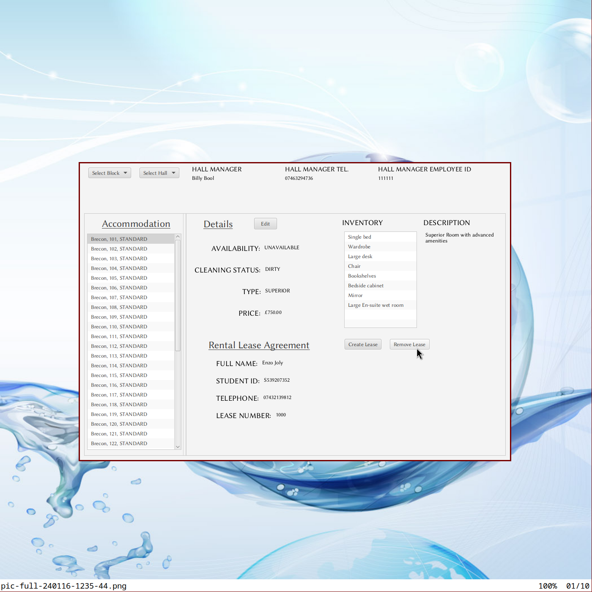

# UWE Accommodation System
University hall accommodation management system made in Java. Loaded with JavaFX API of version 21.0.1 by JavaFX runtime of version 13

##See images above for a preview of the system

Please note: UML diagrams have errors and are not up to date. Please refer to the code for the most up to date version of the system.

(whoever drew those include arrows I'm looking at you 😜)
